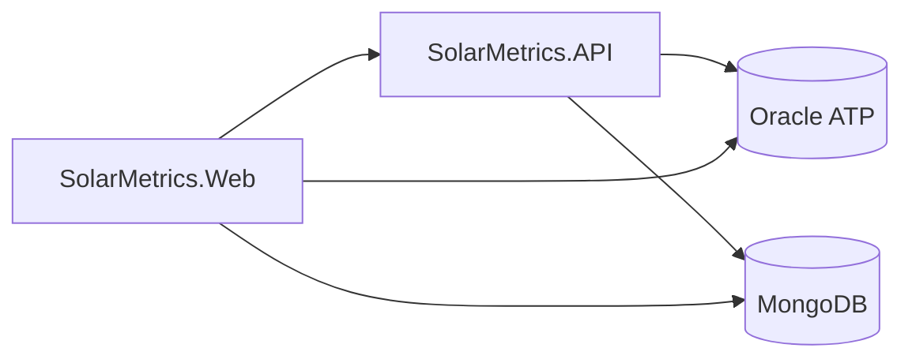

# SolarMetrics — Solução .NET

**SolarMetrics** é uma solução para monitoramento e análise de energia solar: uma **Web API** (dados e integração) e uma **aplicação web MVC** (painel administrativo e fluxos de negócio). O objetivo é integrar sensores IoT, consolidar informações em banco e oferecer visibilidade sobre geração, sistemas e monitoramento — com base confiável para residências e empresas otimizarem consumo e insights.

https://solarmetrics-web.azurewebsites.net/


## O que há na solução

| Projeto | Função |
|--------|--------|
| **SolarMetrics.API** | ASP.NET Core Web API — clientes, autenticação JWT, health checks, observabilidade (Serilog, OpenTelemetry). |
| **SolarMetrics.Web** | ASP.NET Core MVC — áreas **Admin** (dashboard e CRUD de entidades), **Vendas**, autenticação via cookie JWT e acesso ao Oracle via EF Core. |
| **SolarMetrics.UnitTests** | Testes unitários (xUnit, Moq). |
| **SolarMetrics.IntegrationTests** | Testes de integração da API (`WebApplicationFactory`, SQLite em memória). |

SDK alvo: **.NET 8** (veja `global.json` — versão pinada `8.0.400` com `rollForward`).

## Novidades (Sprint 3 — .NET)

- **Health checks** (`Microsoft.Extensions.Diagnostics.HealthChecks`): verificação do banco via EF Core e de um **serviço HTTP externo** configurável (`HealthChecks:ExternalUrl`). Endpoints documentados abaixo.
- **Logging estruturado** com **Serilog** (console + arquivo em `logs/`), níveis configuráveis e **correlação de requisições** via header `X-Correlation-Id`.
- **OpenTelemetry**: tracing e métricas da API (ASP.NET Core, HTTP client, runtime), com exportação para **console** (adequado para desenvolvimento e demonstração).
- **Autenticação JWT** nos endpoints da API; em ambientes não produtivos use `POST /auth/token` para obter um bearer e testar no Swagger.
- **SolarMetrics.Web**: painel **Admin** (Dashboard, Clientes, Sistemas, Painéis solares, Sensores, Monitoramentos), área **Vendas**, login em `/Account/Login` com JWT armazenado em cookie; em desenvolvimento, se a API não estiver disponível, pode ser usado emissor local de token (`LocalJwtIssuer`) como fallback.
- **Testes automatizados**: **SolarMetrics.UnitTests** e **SolarMetrics.IntegrationTests** (JWT nos cenários protegidos da API).

## Interface web (SolarMetrics.Web)

- **URLs de desenvolvimento** (perfil padrão): `http://localhost:5106` (HTTPS alternativo em `https://localhost:7242` — veja `SolarMetrics.Web/Properties/launchSettings.json`).
- **Área Admin** (ex.: `/Admin/Dashboard`): requer usuário autenticado; o token JWT é obtido da API em `POST {Api:BaseUrl}/auth/token` (configurável; padrão `http://localhost:5090`) ou, em **Development**, via fallback local se a API não responder.
- **Configuração**: `Api:BaseUrl`, `Jwt` (mesma chave/issuer/audience coerentes com a API para validação do cookie) e `ConnectionStrings:OracleDb` — preferir **User Secrets** para dados sensíveis.

## Monitoramento e health checks

| Rota | Descrição |
|------|-----------|
| `GET /health` | Todos os checks registrados (banco + URL externa em ambientes que não sejam `Test`). |
| `GET /health/ready` | Apenas checks com tag `ready` (adequado a readiness em orquestradores). |
| `GET /health/live` | Liveness (processo vivo; sem checks adicionais). |

Em **ambiente de testes** (`Test`), o check de URL externa é omitido para estabilidade da suíte de integração.

### Como observar traces e métricas

1. Execute a API: `dotnet run --project SolarMetrics.API`.
2. Gere tráfego (Swagger ou `curl`).
3. Observe o **console**: spans e métricas exportados pelo OpenTelemetry (exportador Console).
4. Opcional: use [`dotnet-counters`](https://learn.microsoft.com/dotnet/core/diagnostics/dotnet-counters) contra o processo da API para inspecionar contadores expostos pelo runtime (ex.: `System.Runtime`).

### Correlação de logs

Envie ou deixe o servidor gerar `X-Correlation-Id`. O valor aparece nos logs Serilog e é devolvido na resposta HTTP.

## Testes

```bash
# Toda a solução
dotnet test

# Somente unitários
dotnet test SolarMetrics.UnitTests/SolarMetrics.UnitTests.csproj

# Somente integração
dotnet test SolarMetrics.IntegrationTests/SolarMetrics.IntegrationTests.csproj
```

- **Unitários**: padrão AAA em casos de uso e regras de domínio (ex.: cliente).
- **Integração**: `WebApplicationFactory` com **Collection Fixture** xUnit; banco SQLite em memória limpo entre testes. Inclui **401** sem token, **204/201/404/409** com JWT na API.

## Novidades anteriores da aplicação

- Interface web para monitoramento e gestão integrada à API.
- Visualização e cadastro de dados relacionados a sensores e sistemas no painel administrativo.

## Requisitos funcionais (visão geral)

- Cadastro e gerenciamento de clientes e dados de sistemas solares.
- Integração com sensores para captura de dados de energia e monitoramento.
- Consulta de dados e operação via API e interface web.

## Requisitos não funcionais (visão geral)

- **Desempenho:** baixa latência para operações em tempo real quando aplicável.
- **Segurança:** proteção de dados, autenticação e autorização (API JWT; Web com cookie HttpOnly).
- **Disponibilidade e escalabilidade:** arquitetura preparada para crescimento de sensores e usuários.
- **Manutenibilidade:** camadas e testes automatizados na API.

## Problemas que a aplicação ajuda a endereçar

- Falta de visibilidade sobre geração e consumo de energia solar.
- Necessidade de centralizar cadastros e monitoramento em um painel web e em uma API consumível.

## Sobre o time

- **Édipo Borges de Carvalho RM:567164**: Responsável pelo banco de dados e Compliance QA.
- **Carlos Clementino RM:561187**: Responsável pelo desenvolvimento da API em .NET e Java Spring Boot, infraestrutura e práticas de DevOps, e pela integração com dispositivos IoT.
- **Eder Silva RM:559647**: Responsável pela criação do APP mobile.

## Como rodar a aplicação

### Pré-requisitos

- **.NET 8 SDK** (recomendado alinhar ao `global.json`: `8.0.400` ou compatível com `rollForward`).
- IDE: **Rider**, **Visual Studio** ou **VS Code**.
- **Oracle Database** para execução completa (connection string + wallet quando aplicável). Os testes de integração da **API** usam **SQLite em memória**.

### Configuração sensível

Não commite senhas. Use **User Secrets** na API e na Web:

**API:**

```bash
cd SolarMetrics.API
dotnet user-secrets init
dotnet user-secrets set "ConnectionStrings:OracleDb" "sua_connection_string"
dotnet user-secrets set "Jwt:Key" "sua_chave_forte_com_pelo_menos_32_caracteres"
```

**Web** (JWT e Oracle devem ser coerentes com o ambiente; `Api:BaseUrl` deve apontar para a API em execução):

```bash
cd SolarMetrics.Web
dotnet user-secrets init
dotnet user-secrets set "ConnectionStrings:OracleDb" "sua_connection_string"
dotnet user-secrets set "Jwt:Key" "mesma_chave_usada_na_api"
dotnet user-secrets set "Api:BaseUrl" "http://localhost:5090"
```

Os arquivos `appsettings.json` contêm apenas **placeholders** ou valores de exemplo para desenvolvimento.

### Passos para executar

1. Clone o repositório:

```bash
git clone https://github.com/ARC-ceo/SolarMetrics-Dotnet.git
```

2. Abra a solução `SolarMetrics.sln`.

3. **API** (Swagger na raiz em desenvolvimento):

```bash
dotnet run --project SolarMetrics.API
```

- HTTP: `http://localhost:5090` (HTTPS: `https://localhost:7113` — veja `SolarMetrics.API/Properties/launchSettings.json`).

4. **Web** (em outro terminal):

```bash
dotnet run --project SolarMetrics.Web
```

- HTTP: `http://localhost:5106`.

Para o login do Admin obter o JWT pela API, suba a **API** antes ou confie no comportamento de **Development** descrito na seção da interface web.

### Testando a API

1. Obtenha um token (ambiente não produtivo): `POST /auth/token` (sem corpo).
2. No Swagger, use **Authorize** e informe `Bearer {access_token}`.
3. Documentação interativa: raiz da API em desenvolvimento (`/` → Swagger UI).

## Arquitetura da solução

Diagrama de componentes e camadas: [`docs/arquitetura-solucao.md`](docs/arquitetura-solucao.md).



## Diagramas

### Modelo físico (MER)


## Apresentação

Assista ao vídeo explicando a proposta tecnológica, o público-alvo e os problemas que a aplicação resolve:  
[Apresentação SolarMetrics](https://youtu.be/Fcza8JBvsyw)

## Endpoints da API

Documentação interativa: **Swagger UI** em `/swagger` (ambientes **Development** e **Staging**; desligado em **Production**). Export OpenAPI: [`docs/openapi/v1/swagger.json`](docs/openapi/v1/swagger.json).

Todas as rotas de consulta (`GET` coleção e `GET` por id) retornam **HATEOAS** (`_links`: self, next, prev, update, delete, etc.).

### Paginação, ordenação e filtros (listagens)

Parâmetros comuns em `GET` de coleção:

| Parâmetro | Descrição |
|-----------|-----------|
| `page` | Página (padrão 1) |
| `pageSize` | Itens por página (padrão 20, máx. 100) |
| `sortBy` | Campo de ordenação (whitelist por recurso) |
| `sortDir` | `asc` ou `desc` |

Filtros por recurso: `nome`, `email`, `tipoUsuario` (Cliente); `nomeInstalacao`, `status`, `clienteId` (Sistema); `modelo`, `fabricante`, `sistemaId` (PainelSolar); `tipo`, `status`, `sistemaId` (Sensor); `sensorId`, `periodo` (Monitoramento).

### Endpoints principais

| Método | Endpoint | Descrição |
|--------|----------|-----------|
| POST | `/auth/token` | Obter JWT (fora de Produção) |
| GET/POST/PUT/DELETE | `/Cliente`, `/Cliente/{id}` | CRUD clientes |
| GET/POST/PUT/DELETE | `/Sistema`, `/Sistema/{id}` | CRUD sistemas |
| GET/POST/PUT/DELETE | `/PainelSolar`, `/PainelSolar/{id}` | CRUD painéis |
| GET/POST/PUT/DELETE | `/Sensor`, `/Sensor/{id}` | CRUD sensores |
| GET/POST/PUT/DELETE | `/Monitoramento`, `/Monitoramento/{id}` | CRUD monitoramentos |
| GET | `/ChatbotInteracoes` | Histórico paginado do chatbot (MongoDB) |
| GET | `/health`, `/health/ready`, `/health/live` | Health checks |

### MongoDB na API

```json
"MongoDb": {
  "Enabled": true,
  "ConnectionString": "mongodb://localhost:27017",
  "DatabaseName": "solarmetrics",
  "ChatbotInteractionsCollection": "chatbot_interactions"
}
```

Com `Enabled: false`, `GET /ChatbotInteracoes` retorna **503**. Use `docker compose up -d mongodb` na raiz do repositório para desenvolvimento.

### Exportar OpenAPI

```bash
dotnet tool install --global Swashbuckle.AspNetCore.Cli
cd SolarMetrics.API
swagger tofile --output ../docs/openapi/v1/swagger.json bin/Debug/net8.0/SolarMetrics.API.dll v1
```

## Tecnologias utilizadas

- .NET 8 / C#
- ASP.NET Core Web API e ASP.NET Core MVC (Razor)
- Entity Framework Core
- Oracle Database
- MongoDB (histórico do chatbot)
- Swagger / OpenAPI
- Autenticação JWT (API e validação na Web)
- Serilog, OpenTelemetry, xUnit, Moq

---

**SolarMetrics** — Sua energia. Seu controle ☀️
