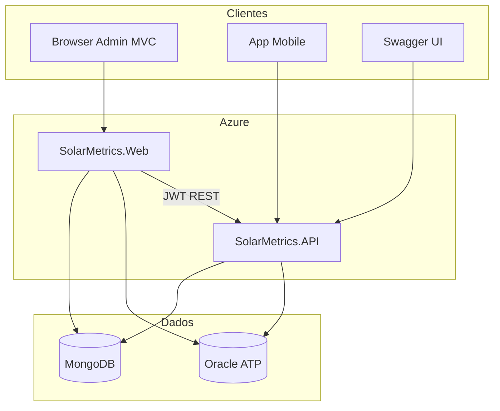

# Arquitetura da solução SolarMetrics

Este documento descreve a **arquitetura de software** (camadas e integrações). O modelo de dados relacional está em `MER.png` na raiz do repositório.

## Diagrama de componentes

## Camadas — SolarMetrics.API

| Camada | Pasta | Responsabilidade |
|--------|-------|------------------|
| Apresentação | `Controllers/` | REST, HATEOAS, validação de entrada (DTOs) |
| Aplicação | `UseCase/` | Regras de negócio e orquestração |
| Domínio | `Domain/` | Regras puras (`EmailFormatoRegra`) |
| Infraestrutura | `Infrastructure/Persistence/`, `Infrastructure/Mongo/` | EF Core Oracle, MongoDB.Driver |
| Transversal | `Common/`, `Middleware/` | Paginação, HATEOAS, exceções globais, correlação |

## Camadas — SolarMetrics.Web

| Camada | Pasta | Responsabilidade |
|--------|-------|------------------|
| UI | `Areas/Admin`, `Areas/Vendas` | MVC Razor, painel administrativo |
| Aplicação | `UseCase/` | CRUD Oracle para telas |
| Infraestrutura | `Repositories/`, `Services/` | EF Core, chatbot Oracle Select AI, MongoDB |

## Fluxo de autenticação

1. Cliente obtém JWT via `POST /auth/token` (API, fora de Produção) ou login Web.
2. Requisições à API enviam `Authorization: Bearer {token}`.
3. A Web armazena o JWT em cookie HttpOnly e valida com a mesma chave `Jwt:Key`.

## Observabilidade (API)

- **Serilog** — logs estruturados (console + arquivo).
- **OpenTelemetry** — tracing e métricas (exportador Console).
- **Health checks** — `/health`, `/health/ready`, `/health/live`.

## NoSQL

Interações do chatbot admin são gravadas pelo **Web** e consultáveis pela **API** (`GET /ChatbotInteracoes`), na coleção `chatbot_interactions`.
